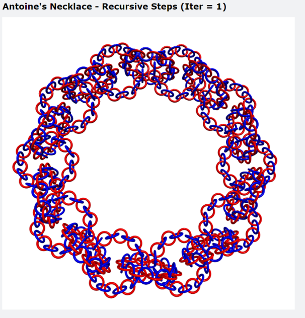
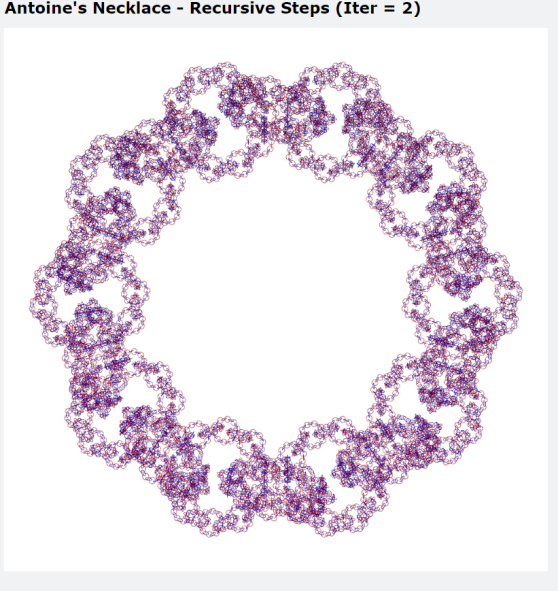

# Antoine's Necklace

A visualization of [Antoine's Necklace](https://www.math.brown.edu/reschwar/M2410B/hw1.pdf) for Professor Richard Schwartz's **MATH 2410: Topology** class (Fall 2022 Semester) in [VPython](https://vpython.org/).
## How to Run
To install dependencies:
```
pip install -r requirements.txt
```
To see the initial stage:
```
python code/initial.py
```
To see the first iteration of Antoine's Necklace:
```
python code/one_step.py
```
To see the n-th iteration of Antoine's Necklace:
```
./run.sh <number of iterations>
```

## Visualization

The initial setup of the Necklace, this is the original chain of tori:


The 1st iteration of Antoine's Necklace:


The 2nd iteration of Antoine's Necklace:


The n-th iteration of Antoine's Necklace (iter = 2 in Figure):


## Known Bugs

When exiting the Browser Window, sometimes it takes a while for the terminal to exit the REPL. This can be temporarily be resolved by closing the terminal and starting a new one.