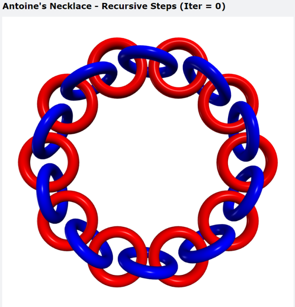

# Antoine's Necklace

Wait, what ... exactly is an Antoine's Necklace?
## How to Run
To see the initial setup:
```
python initial.py
```
To see the n-th iteration of Antoine's Necklace:
```
./run.sh
```

## Visualization

The initial setup of the Necklace, this is the original chain of tori:


The 1st iteration of Antoine's Necklace:


The n-th iteration of Antoine's Necklace (iter = 2 in Figure):


## Known Bugs

When exiting the Browser Window, sometimes it takes a while for the terminal to exit the REPL. This can be temporarily be resolved by closing the terminal and starting a new one.